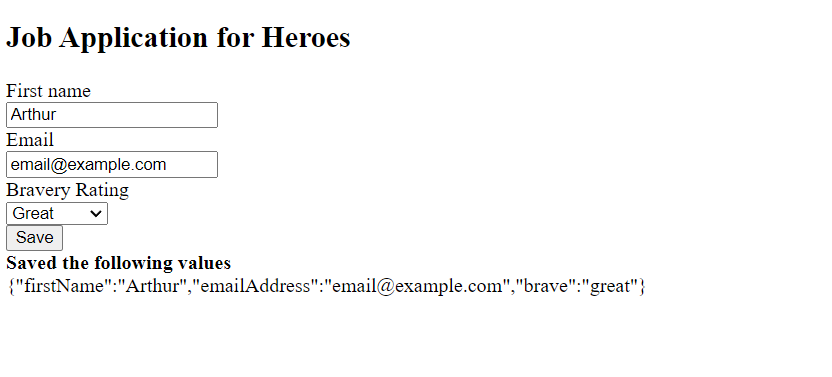
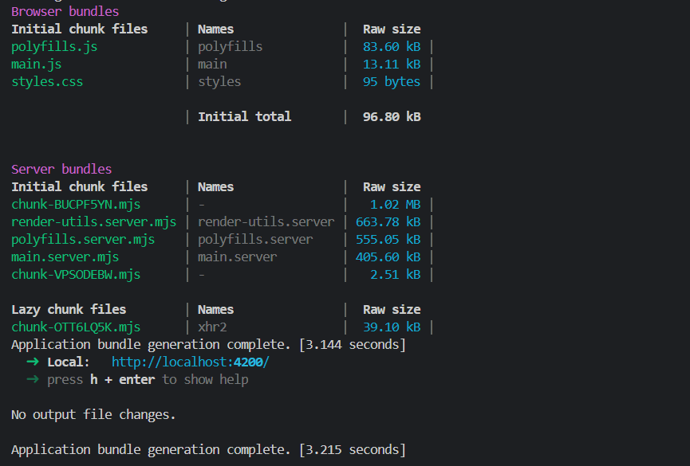

# Atividade ponderada Semana 4

## Tecnologia:
De maneira geral, pode-se definir a tecnologia utilizada, no caso, Angular, como um framework de Front-End que, apesar de ter um grau de complexidade a mais do que frameworks como React, dado a complexidade de escrita, é possivel ver que ele tem estruturas de organização de código mais bem definidas, onde todo o fluxo de importação e exportação de componentes se mostra ser mais organizado.

## O que foi aprendido:
Apesar de ainda precisar de muita pratica para dominar o Angular, acredito que o principal aprendizado foi na contrução dos componentes, o tutorial ajudou bastante a entender a logica da construção de um componente, e com isso, basta replicar este conhecimento.

## Prints:

Front-End:

 
Terminal:
